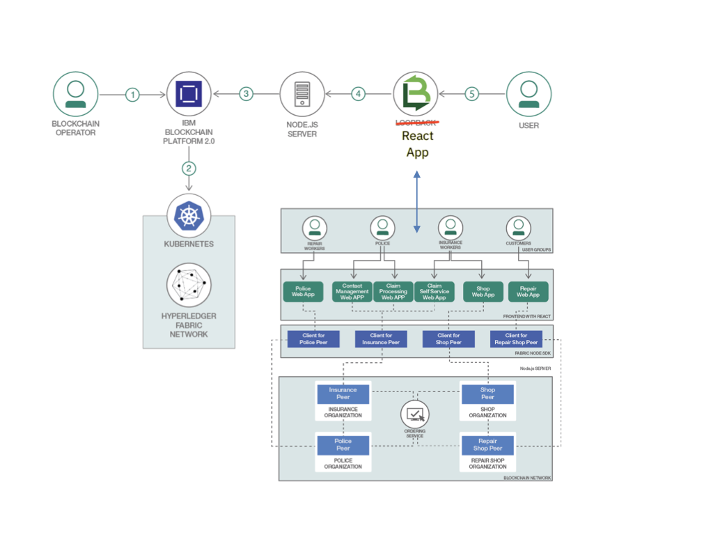

> Use this file to gather the content required for the pattern overview. Copy this draft-patten-template.md file, replace with your own content for each of the sections below, and attach your file to the GitHub tracking issue for your pattern.

> For full details on requirements for each section, see "Write a code pattern overview" on w3 Developer: [https://w3.ibm.com/developer/documentation/write-code-pattern-overview/](https://w3.ibm.com/developer/documentation/write-code-pattern-overview/)

# Short title

> Build a blockchain insurance app

# Long title

> Expand on the short title, focusing on open source or generic tools and programs. Include IBM product names only if that product is required in the pattern and cannot be substituted.

Build a web-based blockchain insurance app using IBM Blockchain Platform and IBM Kubernetes Service 

# Author

* Horea Porutiu <horea.porutiu@ibm.com>
* Ishan Gulhane <ishan.gulhane@ibm.com>

# URLs

### Github repo

> https://github.com/IBM/build-blockchain-insurance-app

### Other URLs

* Demo URL - to be announced soon.

# Summary

> With its distributed ledger, smart contracts, and non-repudiation capabilities, blockchain is revolutionizing the way financial organizations do business, and the insurance industry is no exception. This code pattern shows you how to implement a web-based blockchain app using the IBM Blockchain Platform to facilitate insurance sales and claims.

# Technologies

* [Hyperledger Fabric v1.4](https://hyperledger-fabric.readthedocs.io/en/release-1.4/): A platform for distributed ledger solutions, underpinned by a modular architecture that delivers high degrees of confidentiality, resiliency, flexibility, and scalability.

[Node.js](https://nodejs.org/en/):An open source, cross-platform JavaScript run-time environment that executes server-side JavaScript code.

# Description

Most of us have been there: you’ve just had a fender-bender and now you’re dreading the time and effort it is going to take to deal with your insurance company, the police, and the other driver. Even if things go relatively smoothly, it is still a major disruption of your schedule.

But what if you as a developer could turn things around and actually disrupt the insurance industry? What if you could improve not only your own experience but also that of millions of people around the world dealing with the same inconveniences, delays, and administrative frustrations? Well, this is your chance.

Blockchain presents a huge opportunity for the insurance industry. It offers the chance to innovate around the way data is exchanged, claims are processed, and fraud is prevented. Blockchain can bring together developers from tech companies, regulators, and insurance companies to create a valuable new insurance management asset.

# Flow

1. The blockchain operator creates a IBM Kubernetes Service cluster (<b>32CPU, 32RAM, 3 workers recommended</b>) and an IBM Blockchain 
Platform 2.0 service.
2. The IBM Blockchain Platform 2.0 creates a Hyperledger Fabric network on an IBM Kubernetes 
Service, and the operator installs and instantiates the smart contract on the network.
3. The Node.js application server uses the Fabric SDK to interact with the deployed network on IBM Blockchain Platform 2.0.
4. The React UI uses the Node.js application API to interact and submit transactions to the network.
5. The user interacts with the insurance application web interface to update and query the blockchain ledger and state.

# Instructions

> Find the detailed steps for this pattern in the [readme file](https://github.com/IBM/build-blockchain-insurance-app#steps). The steps will show you how to:

1. Create IBM Cloud services
2. Build a network - Certificate Authority
3. Build a network - Create MSP Definitions
4. Build a network - Create Peers
5. Build a network - Create Orderer
6. Build a network - Create and Join Channel
7. Deploy Insurance Smart Contract on the network
8. Connect application to the network
9. Enroll App Admin Identities
10. Run the application

# Components and services

[IBM Cloud Kubernetes Service](https://cloud.ibm.com/catalog/infrastructure/containers-kubernetes)

[Blockchain Platform 2.0](https://cloud.ibm.com/catalog/services/blockchain-platform-20)

# Runtimes

* Node.js

# Related IBM Developer content
* [Create a basic blockchain network using Blockchain Platform V2.0](https://developer.ibm.com/patterns/build-a-blockchain-network/): Package blockchain smart contracts, set up a Hyperledger Fabric network, and execute a Node.js app with the Hyperledger Fabric SDK to interact with the deployed network.
* [Create a fair trade supply chain network](https://developer.ibm.com/patterns/coffee-supply-chain-network-hyperledger-fabric-blockchain-2/): Use Hyperledger Fabric and IBM Blockchain Platform 2.0 to increase efficiency in the supply chain of a coffee retailer.

# Related links
* [Hyperledger Fabric Docs](https://hyperledger-fabric.readthedocs.io/en/release-1.4/): Enterprise grade permissioned distributed ledger platform that offers modularity and versatility for a broad set of industry use cases.

